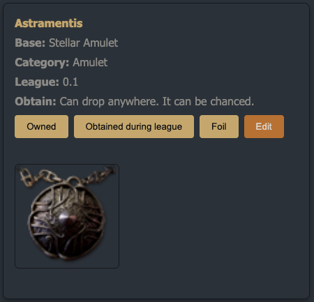
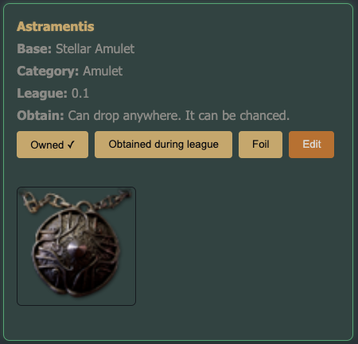
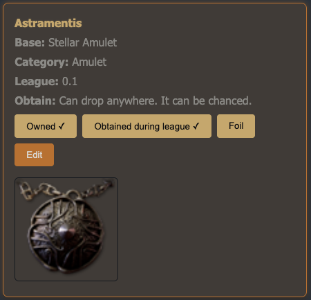
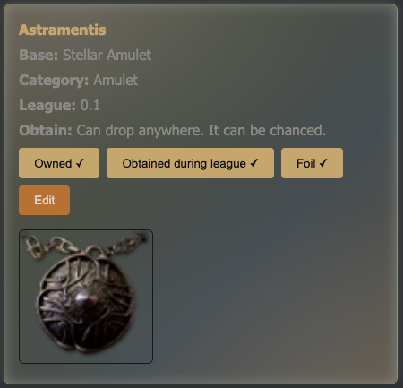
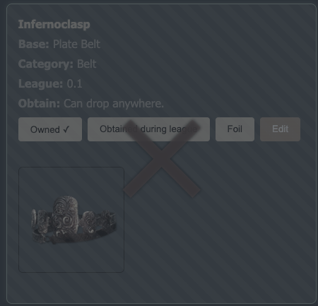

# Vault App

A desktop app for tracking Path of Exile 2 unique items. Built with Electron, React, and TypeScript. Data is stored locally in JSON for fast, offline use.

> Note: The in-app update system was removed. Packaging and releases still work; there are no automatic update checks.

## Download

Always points to the latest release builds:

- Windows (latest): [VaultApp-Windows.zip](https://github.com/Regnitiel/poe2vault/releases/latest/download/VaultApp-Windows.zip)
- macOS (latest): [VaultApp-macOS.zip](https://github.com/Regnitiel/poe2vault/releases/latest/download/VaultApp-macOS.zip)

## Features

- Collection tracking with progress by category and league
- Powerful filtering and search in the vault
- One-click toggles: Owned, Obtained During League, Foil
- Local JSON storage with import/export options

## Screenshots

### Home Dashboard

### Vault

### Item States

- Not Owned

  

- Owned

  

- Obtained During League

  

- Foiled

  

- Disabled (display-only)

  

## Perfect for

- Completionists tracking every unique
- League players monitoring progress per season
- Offline-first users who want simple JSON-based data

---

Ready to start tracking your POE2 uniques? Download and run the app above.
